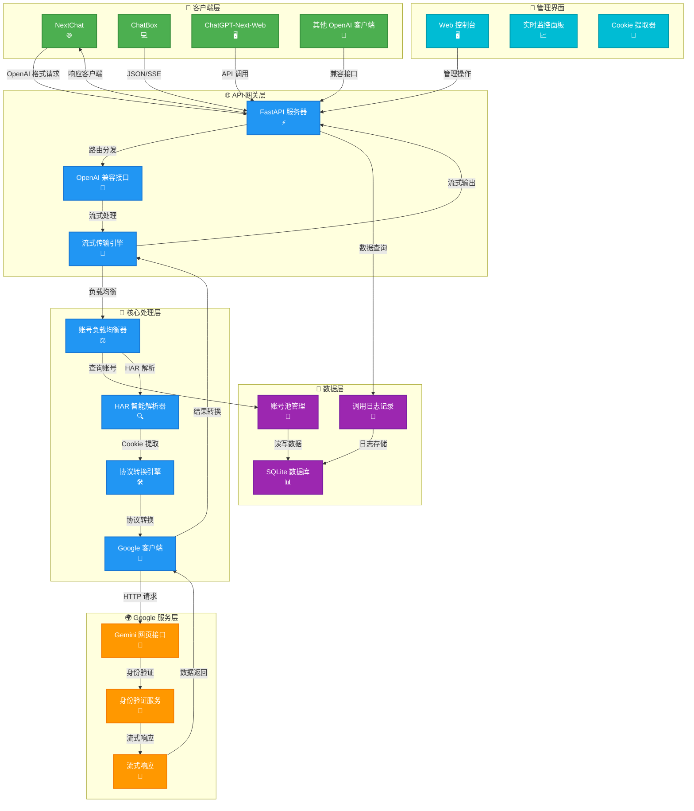
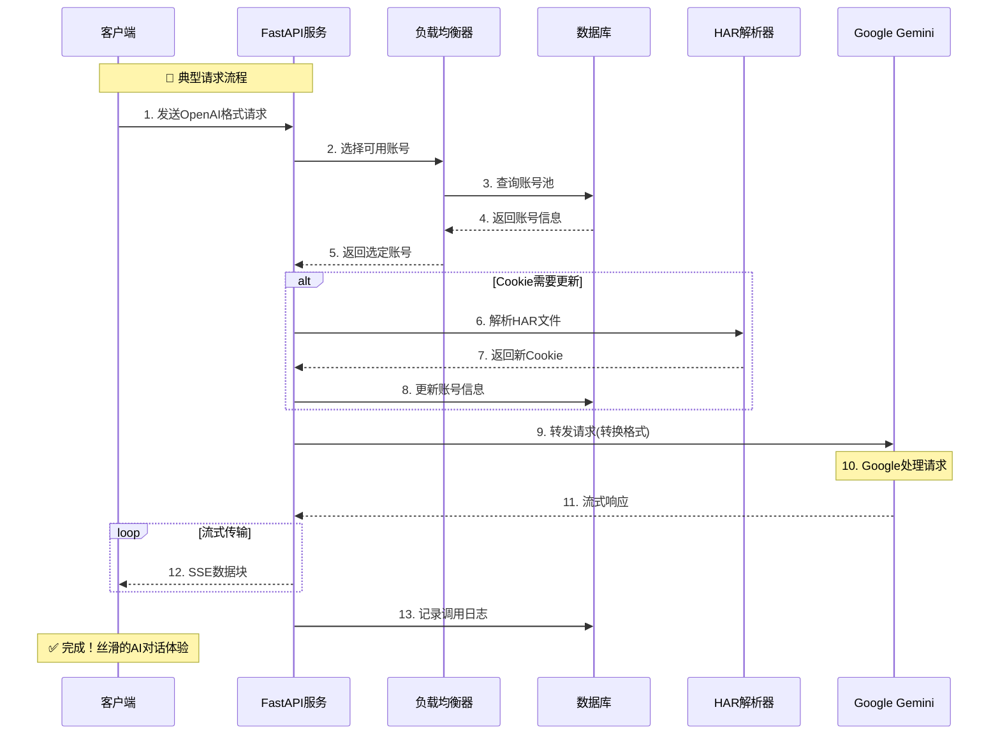

### 使用效果和需要提取的这个cookie等等的，大家一定不要提取那个src等等那条，因为到那条都已经改变了cookie

> 使用效果如上


# 🌌 Gemini Python: 谷歌 Gemini 逆向 API 服务端
> **让每个人都能以最优雅、最自由的方式连接 AI 的智慧海洋。**

[](https://opensource.org/licenses/Apache-2.0)
[](https://www.python.org/)
[](https://fastapi.tiangolo.com/)
[](https://platform.openai.com/docs/api-reference)

---

## 📖 目录

- [🎯 项目哲学与初衷](#-项目哲学与初衷)
- [✨ 核心功能](#-核心功能)
- [⚖️ 优缺点分析](#️-优缺点分析)
- [🚀 系统架构图](#-系统架构图)
- [📦 快速安装指南](#-快速安装指南)
- [📂 项目结构详解](#-项目结构详解)
- [🔬 核心技术原理](#-核心技术原理)
- [🛠️ 使用指南](#️-使用指南)
- [🗺️ 开发路线图](#️-开发路线图)
- [🔧 开发者指南](#-开发者指南)
- [❓ 常见问题](#-常见问题)
- [❤️ 致谢与开源](#️-致谢与开源)

---

## 🎯 项目哲学与初衷

在这个 AI 技术飞速发展的时代，我们坚信技术应该**普惠、开放、可理解**。**Gemini Python** 的诞生源于以下核心理念：

### 🌍 **技术民主化**
通过逆向工程解构复杂的技术黑盒，让每个人都能理解和使用最前沿的 AI 能力，打破技术壁垒。

### 💡 **代码即艺术**
我们追求简洁、优雅、高效的代码实现。每一行代码都是对技术美学的诠释，每一个模块都是精心设计的艺术品。

### 🔍 **学习与探索**
本项目不仅是工具，更是学习 HTTP 协议、网络安全、Python 异步编程和逆向工程的绝佳教材。我们相信：**你行，你真的行！**

### 🛡️ **隐私与自主**
数据应该掌握在用户手中。本地部署，数据不上云，保护你的隐私安全。

---

## ✨ 核心功能

### 🚀 **OpenAI API 完全兼容**
- 支持标准的 `/v1/chat/completions` 接口
- 完美兼容 NextChat、ChatBox、ChatGPT-Next-Web 等客户端
- 原生支持流式输出 (Server-Sent Events)，实现丝滑打字机效果

### 🧠 **智能 HAR 解析器**
- 🔍 自动从 HAR 文件提取 Cookie 和动态参数
- 📋 支持多种格式：网络请求头、cURL 命令、原始 HAR 文件
- 🛡️ 容错性强，即使是不完整的日志也能智能解析

### ⚖️ **多账号负载均衡**
- 🎯 基于 SQLite 的轻量级账号池管理
- 🔄 智能轮询算法，自动选择可用账号
- 📊 实时监控账号状态和调用统计

### ⚡ **高性能异步架构**
- 🏃 基于 FastAPI + uvicorn 的高性能异步框架
- 💾 内存占用 < 50MB，极速响应
- 🚫 **无头浏览器依赖**，纯 HTTP 协议通信

### 🎨 **现代化管理界面**
- 🌐 响应式 Web 管理后台
- 📈 实时调用日志监控
- 🔧 账号一键添加/删除/启用/禁用

---

## ⚖️ 优缺点分析

### ✅ **核心优势**

| 优势 | 说明 |
|------|------|
| **💰 完全免费** | 使用 Google Gemini 网页版免费额度 |
| **🔒 数据安全** | 所有数据流经本地服务器，不上传第三方 |
| **⚡ 性能优异** | 内存占用小，响应速度快，支持高并发 |
| **🔄 持续更新** | 社区活跃，及时适配 Google 接口变更 |
| **🎓 学习价值** | 优秀的逆向工程学习案例 |

### ⚠️ **注意事项**

| 限制 | 说明 | 解决方案 |
|------|------|----------|
| **Cookie 有效期** | Google Cookie 约 2-4 周过期 | 定期更新 Cookie |
| **IP 地区限制** | 需要美国/新加坡等支持地区 | 使用对应地区的代理 |
| **风控风险** | 高频使用可能触发验证 | 多账号轮询，控制频率 |
| **非官方接口** | Google 可能变更接口 | 关注项目更新 |

---

## 🚀 系统架构图



### 📊 **数据流程图**


---

## 📦 快速安装指南

### 🪟 **Windows 一键安装** (推荐 ⭐⭐⭐⭐⭐)

```bash
# 1. 下载项目
git clone https://github.com/lza6/gemini.google-2api-python.git
cd gemini.google-2api-python

# 2. 双击运行安装脚本
start.bat
```

📌 **脚本自动完成以下操作：**
- ✅ 检查 Python 3.8+ 环境
- ✅ 安装所有依赖包
- ✅ 复制配置文件模板
- ✅ 启动服务器并打开浏览器

### 🐧 **Linux/Mac 快速安装**

```bash
# 1. 克隆项目
git clone https://github.com/lza6/gemini.google-2api-python.git
cd gemini.google-2api-python

# 2. 安装依赖
pip install -r requirements.txt

# 3. 配置环境
cp .env.example .env
# 编辑 .env 文件，填入代理信息

# 4. 启动服务
python main.py
```

### 🐳 **Docker 部署** (即将推出)

```bash
# 敬请期待！
docker run -p 8090:8090 gemini-python:latest
```

---

## 📂 项目结构详解

```tree
gemini-python/
├── 📁 core/                    # 核心业务模块
│   ├── __init__.py
│   ├── api_handler.py         # OpenAI API 兼容处理
│   ├── account_manager.py     # 账号池管理
│   └── stream_generator.py    # 流式响应生成器
│
├── 📁 services/               # 服务层
│   ├── __init__.py
│   ├── gemini_service.py      # Gemini 通信服务
│   ├── har_service.py         # HAR 解析服务
│   └── proxy_service.py       # 代理管理服务
│
├── 📁 models/                 # 数据模型
│   ├── __init__.py
│   ├── account.py             # 账号数据模型
│   └── request.py             # 请求数据模型
│
├── 📁 database/               # 数据库层
│   ├── __init__.py
│   ├── db_manager.py          # 数据库管理
│   └── migrations/            # 数据库迁移
│
├── 📁 web/                    # Web 界面
│   ├── templates/
│   │   └── dashboard.html     # 管理界面模板
│   └── static/
│       ├── css/
│       └── js/
│
├── 📁 utils/                  # 工具函数
│   ├── __init__.py
│   ├── logger.py              # 日志工具
│   ├── validator.py           # 数据验证
│   └── helper.py              # 辅助函数
│
├── 📄 main.py                 # 🏃 应用入口
├── 📄 config.py               # ⚙️ 配置文件
├── 📄 requirements.txt        # 📦 依赖列表
├── 📄 .env                    # 🔐 环境变量
├── 📄 start.bat               # 🪟 Windows启动脚本
└── 📄 README.md               # 📖 项目文档
```

### 📋 **关键文件说明**

| 文件 | 功能描述 | 重要性 |
|------|----------|--------|
| `main.py` | FastAPI 主应用，路由入口 | ⭐⭐⭐⭐⭐ |
| `config.py` | 配置管理，环境变量加载 | ⭐⭐⭐⭐ |
| `har_parser.py` | HAR 文件智能解析器 | ⭐⭐⭐⭐ |
| `gemini_service.py` | Gemini 协议通信核心 | ⭐⭐⭐⭐⭐ |
| `dashboard.html` | Web 管理界面 | ⭐⭐⭐ |

---

## 🔬 核心技术原理

### 1. 🧩 **协议逆向工程**

**技术栈：** HTTP/2 + TLS + Protobuf-like 协议

```python
# Gemini 协议请求结构示意
class GeminiRequest:
    """
    模拟 Google RPC (Batchexecute) 协议
    关键参数：
    - f.sid: 会话ID (来自URL参数)
    - at: 认证令牌 (来自POST数据)
    - __Secure-1PSID: 主Cookie
    - __Secure-1PSIDTS: 时间戳Cookie
    """
```

### 2. 🔄 **OpenAI 协议转换**

```python
# OpenAI → Gemini 格式转换
def convert_to_gemini_format(openai_messages):
    """
    转换逻辑：
    system → 系统提示
    user → 用户输入
    assistant → 模型回复（上下文）
    
    支持多轮对话保持上下文
    """
```

### 3. 📡 **流式传输实现**

```python
# Server-Sent Events 实现
async def stream_generator(text, model):
    """
    关键技术点：
    1. 使用 async generator 实现异步流
    2. 遵守 OpenAI SSE 格式规范
    3. 实时转换 Gemini 流式响应
    4. 支持中断和错误处理
    """
```

### 4. 🛡️ **安全与稳定性**

- **智能重试机制**: 自动切换账号，避免单点故障
- **连接池管理**: 复用 HTTP 连接，提升性能
- **超时控制**: 多级超时设置，防止请求挂起
- **异常隔离**: 单账号故障不影响整体服务

---

## 🛠️ 使用指南

### 1. 🍪 **获取 Gemini Cookie**

```bash
# 方法一：Chrome DevTools
1. 打开无痕窗口访问 https://gemini.google.com
2. 按 F12 → Network → 勾选 Preserve log
3. 发送一条消息
4. 找到 /StreamGenerate 请求
5. 右键 → Copy → Copy as cURL

# 方法二：浏览器扩展
1. 安装 Cookie Editor 扩展
2. 导出 Cookie 为 JSON
3. 粘贴到管理界面
```

### 2. ⚙️ **配置项目**

```env
# .env 配置文件
API_MASTER_KEY=sk-any-key-you-like    # API密钥（任意值）
SERVER_PORT=8090                      # 服务端口
PROXY_URL=http://127.0.0.1:7890       # 代理地址（必须）
LOG_LEVEL=INFO                        # 日志级别
```

### 3. 🚀 **启动服务**

```bash
# 启动命令
python main.py

# 访问管理界面
http://127.0.0.1:8090
```

### 4. 🔌 **客户端配置**

| 客户端 | 配置项 | 值 |
|--------|--------|-----|
| **NextChat** | Base URL | `http://127.0.0.1:8090` |
| **ChatBox** | API Key | 任意填写 |
| **ChatGPT-Next-Web** | Model | `gemini-2.5-pro` |
| **API 调用** | Endpoint | `/v1/chat/completions` |

---

## 🗺️ 开发路线图

### 🎯 **已实现功能** (v1.0)
- ✅ OpenAI API 完全兼容
- ✅ 流式传输支持
- ✅ 多账号负载均衡
- ✅ HAR 智能解析器
- ✅ Web 管理界面
- ✅ 详细错误诊断

### 🔄 **进行中功能** (v1.1)
- 🚧 多模态支持（图片上传）
- 🚧 文件分析（PDF/CSV/TXT）
- 🚧 Docker 容器化部署
- 🚧 API 密钥鉴权系统

### 📅 **规划功能** (v1.2+)
- 📋 插件系统扩展
- 📋 分布式部署支持
- 📋 性能监控面板
- 📋 自动 Cookie 刷新

---

## 🔧 开发者指南

### 🛠️ **环境搭建**

```bash
# 1. 创建虚拟环境
python -m venv venv
source venv/bin/activate  # Linux/Mac
venv\Scripts\activate     # Windows

# 2. 安装开发依赖
pip install -r requirements-dev.txt

# 3. 设置开发配置
cp .env.dev .env
```

### 📝 **代码贡献**

1. **Fork 项目仓库**
2. **创建功能分支**
3. **编写测试用例**
4. **提交 Pull Request**

### 🧪 **测试运行**

```bash
# 运行单元测试
pytest tests/

# 运行集成测试
python tests/integration.py

# 代码质量检查
flake8 . --max-line-length=88
black .
```

### 📦 **打包发布**

```bash
# 构建包
python setup.py sdist bdist_wheel

# 测试发布
twine upload --repository testpypi dist/*

# 正式发布
twine upload dist/*
```

---

## ❓ 常见问题

### 🚨 **常见错误与解决方案**

| 错误信息 | 可能原因 | 解决方案 |
|----------|----------|----------|
| `Cookies invalid` | Cookie 过期 | 重新获取 Cookie |
| `Location mismatch` | IP 地区不对 | 切换代理到美国/新加坡 |
| `Timeout` | 代理不稳定 | 检查代理连接 |
| `SNlM0e not found` | 页面解析失败 | 使用无痕模式重新获取 |

### 🔍 **调试技巧**

```bash
# 1. 检查代理连通性
python debug_google.py

# 2. 查看详细日志
tail -f logs/app.log

# 3. 测试单个账号
python test_account.py --cookie "your_cookie"
```

### ⚡ **性能优化**

1. **使用连接池**: 配置 HTTP 连接复用
2. **启用缓存**: 缓存 Gemini 初始化结果
3. **批量处理**: 合并小请求，减少开销
4. **异步优化**: 使用 `uvloop` 提升性能

---

## ❤️ 致谢与开源

### 🏆 **技术依赖**
- [FastAPI](https://fastapi.tiangolo.com/) - 现代、快速（高性能）的 Web 框架
- [gemini-webapi](https://github.com/dsdanielpark/gemini-webapi) - Gemini 逆向库
- [SQLite](https://www.sqlite.org/) - 轻量级嵌入式数据库
- [Bootstrap](https://getbootstrap.com/) - 响应式前端框架

### 👥 **贡献者**
感谢所有为项目做出贡献的开发者，你们的每一行代码、每一个 Issue、每一次 Star 都让这个项目变得更好。

### 🌟 **支持我们**
如果你觉得这个项目有用，请：

1. ⭐ **Star 这个仓库** - 让更多人看到
2. 🐛 **报告 Issues** - 帮助我们改进
3. 🔧 **提交 PR** - 贡献你的代码
4. 📢 **分享给朋友** - 传播开源精神

---

## 🎯 **立即开始**

```bash
# 克隆项目
git clone https://github.com/lza6/gemini-python.git

# 一键启动
cd gemini-python
./start.sh  # 或双击 start.bat
```

🌐 **访问管理界面**: [http://127.0.0.1:8090](http://127.0.0.1:8090)

💬 **加入社区**: [GitHub Discussions](https://github.com/lza6/gemini-python/discussions)

📚 **阅读文档**: [完整文档](https://github.com/lza6/gemini-python/wiki)

---

*✨ 让技术之光，照亮每个人的探索之路。*  
*—— Gemini Python 开发团队*
